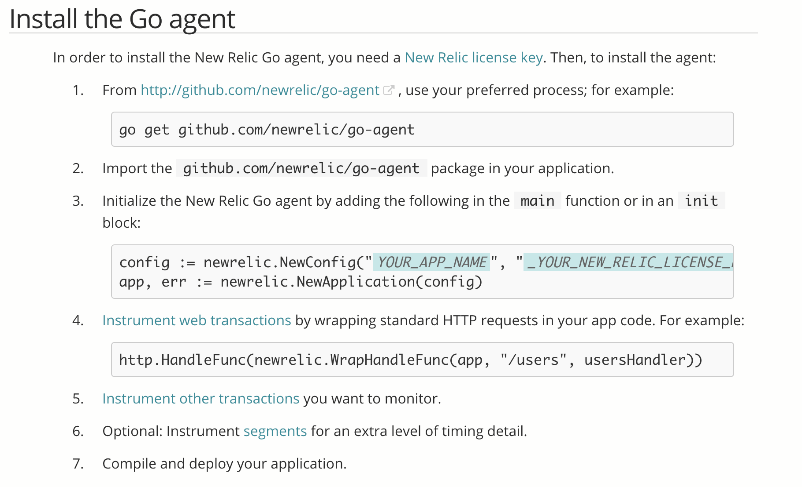
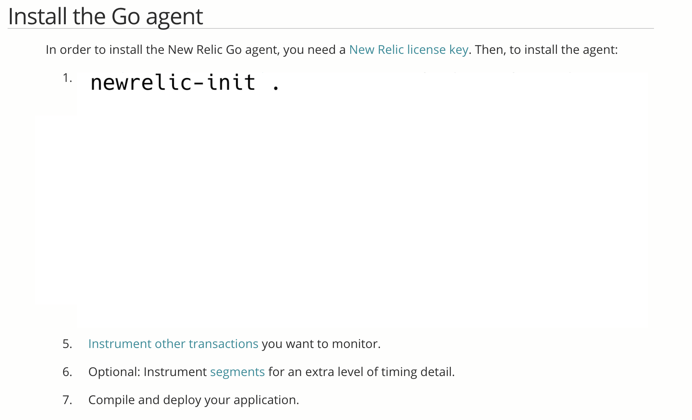
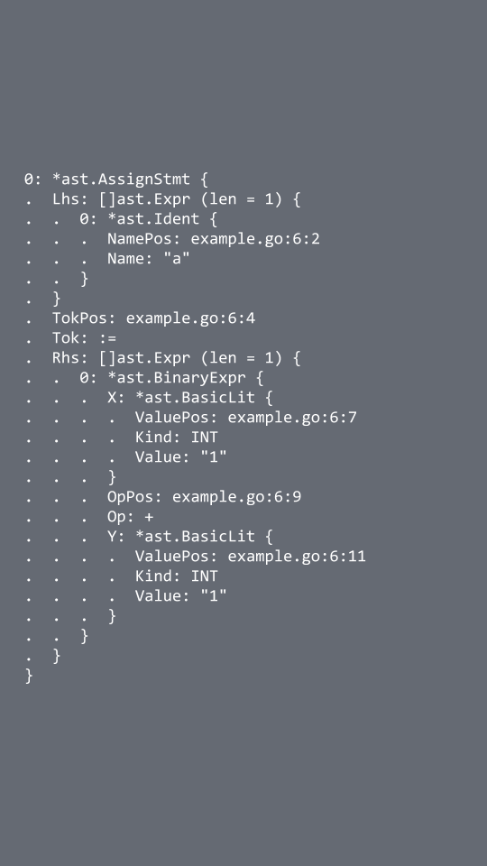

autoscale: true
theme: Plain Jane, 3
code: Hack
slidenumbers: true
footer: Baltimore Golang - 1/8/2019

[.header: alignment(center)]

# [fit] I couldn't think of a good title

# [fit] but this talk is about newrelic, instrumenting go with AST rewrites, and some other stuff too

---

[.autoscale: true]

[.header: alignment(center)]
# Hello, I'm Ehden

node.js agent engineer @ Contrast Security
Go enthusiast

@cixel (Gopher slack)
[github.com/cixel](https://github.com/cixel)
[ehdens@gmail.com](mailto:ehdens@gmail.com)
[ehden@contrastsecurity.com](mailto:ehden@contrastsecurity.com)


^ My name is Ehden, I work at a company called Contrast Security. We're up in Brown's Wharf in Fell's Point

^ I don't officially get paid to do Go.

^ My day job is on an instrumentation agent in Node.js and in fact what Contrast does is all based around a set of language specific instrumentation agents.

^ So I spend a lot of time in javascript and after a couple of years of this I thought "I should learn a new language"

^ So I set out to learn a new language nights/weekends, and for reasons "I did not know and could not remember", I chose Go

---

# How to ~~learn~~ use a programming language

1. Use the language
1. Use Google
1. Repeat

^ So this is how I learn new languages

^ This is probably how most people do it, but honestly this is the workflow you see at all levels

^ the more experienced you are the better you are at step 2, you know what to ask google for

^ so starting out, I just would pick random small projects and go at them, understanding that i'd need to Google pretty much every line of code for a while

---

> *How can I do my day job in this language?*
-- me, some time in 2017

^ but I also program for a living and so after a bit I started to ask myself this question

^ probably a sign of bad work-life balance

^ probably not a healthy thought

^ but regardless, that's how i got really into Go, and it's kind of the backdrop for this talk, so I'll spend just a bit of time talking about my day job

^ I don't mean for this to be a sales pitch in any way, so I'm gonna try to be informative rather than prescriptive


---

# Agents

1. user adds agent to an app
1. agent weaves itself into functions it cares about
    - request start/end
    - db queries
    - file system operations
1. agent changes function behavior (usually preserves semantics)

^ I don't mean for this to be a sales pitch in any way, so I'm gonna try to keep this informative rather than prescriptive

^ The best analogy I've ever managed to find for what an agent is and how it works is a virus.

^ Not necessarily a computer virus, but a virus in nature

^ (there are actually good viruses, like some bacteriophages, that we've known about and used for decades, but lots of research is being done into how to use and exploit the mechanics of virus for good things. in software, we call these agents)

^ Now it's not a fantastic analogy and I'm probably not supposed to go around saying "Contrast is kinda like a virus" so don't quote me on this

^ The gist of it is that an agent sits inside the app, and changes the app's behavior somehow

^ The details of this kinda vary but the key is that the app is doing the work. The agent becomes part of the app

^ For example, New Relic looks at things like request start/end and makes them report a transaction ID and a time stamp so that it can measure how long requests take

^ As an aside, my understanding is this is real imagery captured of a virus infecting a cell in 3 parts and how fucking cool is that


---

^ anyway here is a route handler in a hypothetical node.js app

^ it takes a flight number from the query string [build]

^ queries a DB for the flight times, and then responds with all of that stuff [build, build]

^ there is a LOT wrong with this

^ like if I ever saw something like this in production code, I think I would just panic

^ I would get up and pull the fire alarm and have no idea why [build]

^ for starters: anybody using this app can do whatever they want to your database, and can dump whatever they want into the response body

^ so we'd say this is vulnerable to SQL injection and to XSS via reflection

[.code-highlight: all]
[.code-highlight: 2]
[.code-highlight: 3]
[.code-highlight: 9]
[.code-highlight: all]
[.code-highlight: 2,3,9]

```javascript
app.get('/time', (req, res) => {
  const flightNumber = req.query.flightNumber
  db.query('SELECT Departure,Arrival FROM Flights WHERE FlightNumber = ' + flightNumber, (err, rows) => {
  	if (err) { res.send(err); return; }

	const dep = rows[0].Departure
	const arr = rows[0].Arrival

  	res.send('Flight ' + flightNumber + ' will depart at ' + dep + ' and arrive at ' + arr)
  })
})

// $ curl www.airliner.com/time?flightNumber=12345
// Flight 12345 will depart at 2:30pm and arrive at 3:30pm%
```

---

[.header: alignment(left)]

# Terminology

### *source: where user controlled data comes from*

```javascript
const flightNumber = req.query.flightNumber
```

### *sink: where user controlled data ends up*
```javascript
db.query(/*...*/)
res.send(/*...*/)
```

^ so general security jargon

^ sources and sinks are generally where data starts and ends, which is something you look at when trying to find vulns

^ so that query string is a source

^ db.query is a sink for SQL injection

^ if you were in these, you can do a lot. for example, new relic is gonna instrument these methods to measure things like request time

^ Contrast instruments them to look and see if the app is being attacked or not

---

[.header: alignment(left)]

# Terminology (cont.)

### propagator: *everything in between*

```javascript
'Flight ' + flightNumber
```

^ and propagators are everything in between. something which propagates 'taint' from one string to another, and you'll see what I mean in a sec

^ This is where new relic and Contrast part ways as far as what we need to instrument

^ If you want to be really accurate when reporting that there's a vulnerability, you have to track everything that happens to user controlled strings from start to finish

^ That means we're ALSO sitting inside +, and all string operations, etc.


---

sql injection


^ here's the full dataflow for a SQL injection

^ (describe what red means, go through source, propagator, sink)

^ by the time the string ends up in our sink, we know that argument string is user controlled on index X to Y, whatever indexes 12345 is.

^ it doesn't matter that the rest is clean, and doesn't matter that 12345 isn't an attack

^ what matters is that a portion of the input to db.query is user controlled

^ so when this happens at runtime, the agent reports a sql injection vulnerability

---

xss


---

[.header: alignment(left)]
# How it works


---

[.header: alignment(left)]
# How it works

- the answer is long and ~~boring~~technical
- ask me later if you're curious about javascript instrumentation


^ The honest answer to how we get 'inside' all of those operations isn't really closely guarded

^ It's just a lot to relay and it varies from language to language

^ And varies in complexity depending on what we're trying to see

^ For example, monkey patching response.send in node is very easy, but getting inside of the plus operator or request property access is a bit more involved

^ I actually gave another talk on some of the techniques we use to do this in javascript, those slides are on my github

^ So I had no idea how to approach this in Go

^ Go is super different from JS. It's different from any language we support, so I really couldn't even ask colleagues of mine.

^ So I did what any self-respecting developer would do and I tried to look up the answer

---

# New Relic

^ So I did what any self-respecting developer would do and I tried to look up the answer

^ I'm pretty familiar with New Relic's node offering, so I tried to look up what they were doing for Go



^ This was pretty disappointing. This installation and workflow is different than what I was used to seeing from them in any other language

^ (Explain how it's an SDK)

^ Now I'm not saying this to disparrage new relic. NR is awesome

^ like I said, they were the first place I looked to for a way to do this

^ But like I said, we need to see a LOT more than new relic does. So this may work for them, but it's not even remotely tenable for us

^ If it takes a developer 30 minutes to go through an app and add this code it would take hours just to add all of our sources and sinks

^ shpiel about how much more we need to do

^ so my disappointment was simply that I looked at new relic for a magic answer and did not get that

---

# How it works (in Go)

^ So this became my personal project, nights/weekends, figuring out how to build an agent in Go

^ no primitives for intercepting function calls.

^ There's no compiler flag for injecting JMPs into compiled functions

^ So this project took me all over the place, like at one point I was forking the Go compiler

---

# How it works (in Go)

- AST rewriting
- wrap all function calls generically; event-based enter/leave hooks
- redefine function declarations to weave context through async boundaries
- WIP; still a few big hurdles to get over
- not open source, parts may become open source over time
- sorry

^ I settled on doing everything via AST rewrites

^ the code this thing produces is gnarly

^ it's not really meant for human consumption

^ there are a couple of big problems to solve

^ can't share code

^ And I didn't want to stand here and show off a project I can't give people full access to

^ But I sure can change it slightly, throw it in a separate project, and present on that

---

# [github.com/cixel/newrelic-init](https://github.com/cixel/newrelic-init/)



^ So I pulled some stuff out, copied it into another project, and here's something that functions in much the same way as what I've been working on

^ It's called newrelic-init, everything is on github

^ The idea is just that it's a cli tool you can run to take care of steps 1-4 of the original instructions

^ It's kinda easy to stretch this stuff out to 5-6 but you'd have to define some way of telling the tool what functions you care about

^ Step 7 can also happen programatically

---

# How newrelic-init works

~~magic~~

1. adds `import github.com/newrelic/go-agent` (and other imports)
1. adds an `init` function which sets up monitoring (per the docs)
1. walks the package, wrapping invokations of `http.HandleFunc`

^ So unlike my personal project, the generated code here IS meant for human consumption

^ We'll come across the implications of that in a bit

^ But the general idea is that you give it a package directory and it'll just add newrelic for you

---


# Abstract Syntax Trees

> an abstract syntax tree (AST), or just syntax tree, is a tree representation of the abstract syntactic structure of source code written in a programming language.
--Wikipedia

^ quick definition

---

[.header: alignment(left)]

# `go/ast`

```go
a := 1 + 1
```

- defines AST types and interfaces
- closely related to:
	- `go/format`
	- `go/parser`
	- `go/printer`
	- `go/scanner`
    - `go/token`
	- `go/types`
	- `...`



^ what a Go AST looks like

^ you can see there's actually a bit of position info, this is important later

^ and all of this stuff comes from a standard library package, which is awesome

^ now for a tiny code snippet like this, this blob really isn't that bad

^ but you can see how it  can get kinda gnarly; generating nodes programatically is a big part of rewriting, which involves a lot of checking go doc for info on the structures involved

---

[.header: alignment(left)]

# AST rewriting 101:

1. parse source code into AST
1. traverse tree, changing whatever you want
1. print the tree back out as source

```go
import (
	"golang.org/x/tools/go/ast/astutil"
	"golang.org/x/tools/go/packages"
)
```


^ So the mechanics get messy

^ There used to be a lot of boilerplate

^ you had to use the stdlib to find the disk location of files in a pkg

^ read the files

^ set up type checker, call parser

^ traverse AST w/ limited functions for rewriting, very tedious to change anything

^ astutil (gri) eases a lot of the messiness of dealing with a physical AST

^ go/packages (go team) removes a lot of the boilerplate needed to actually get to an AST

^ you pass it a config and a directory and it automatically hands you this beautifully parsed and typed-checked package

^ it's a convenient wrapper on all of those other packages

^ there is a cabal of people who work on Go whose contributions are centered on tooling, and have been actively reaching out to tool developers in open source and trying to get them to convert to go/packages instead of rolling their own solutions by composing the packages mentioned in the previous slide

---

```go
cfg := &packages.Config{
	Mode: packages.LoadAllSyntax,
}

pkgs, err := packages.Load(cfg, ".")
if err != nil {
	log.Fatal(err)
}

packages.Visit(pkgs, func(*packages.Package) bool {
	return true
}, func(p *packages.Package) {
	for _, file := range p.Syntax {
		astutil.Apply(file, nil, func(c *astutil.Cursor) bool {
			// ...
			return true
		})
	}
})
```

^ abstract example

^ with these packages, here's kind of the boilerplate for traversing and modifying an AST

^ doesn't include printing the AST

^ ... is where you can do anything you want

---

[.code-highlight: all]
[.code-highlight: 9]
[.code-highlight: 9, 14]
[.code-highlight: 9, 14, 18, 21]
[.code-highlight: 9, 14, 18, 21, 23, 24]

```go
func injectInit(pkg *packages.Package) {
	if pkg.Name != "main" {
		return
	}

	f := pkg.Syntax[0]
	// not sure if I should go through apply/replace here, or just modify the file directly
	astutil.Apply(f, func(c *astutil.Cursor) bool {
		file, ok := c.Node().(*ast.File)
		if !ok {
			return true
		}

		d := buildInitFunc()

		// add our package-wide 'app' variable to assign to
		// for use by wrappers
		file.Decls = append(file.Decls, appVar())

		// cannot c.Replace File nodes (see Cursor doc for reasoning) so we modify the File directly
		file.Decls = append(file.Decls, d)

		astutil.AddNamedImport(pkg.Fset, f, "newrelic", "github.com/newrelic/go-agent")
		astutil.AddImport(pkg.Fset, f, "os")

		return false

	}, nil)
}
```

^ so this is how we inject our init

^ [build] in Apply, do a type check, to see if we're currently visiting a File node

^ [build] we generate some AST nodes, which I'll go over in a sec

^ [build] then we just append to the list of declarations in the file

^ [build] and add whatever imports we need

^ so i'm not kidding when I say libraries really simplify a lot of this

---

```go
// creates the node: `var newrelicApp newrelic.Application`
func appVar() *ast.GenDecl {
	d := &ast.GenDecl{
		Tok: token.VAR,
		Specs: []ast.Spec{
			&ast.ValueSpec{
				Names: []*ast.Ident{ast.NewIdent("newrelicApp")},
				Type: &ast.SelectorExpr{
					X:   ast.NewIdent("newrelic"),
					Sel: ast.NewIdent("Application"),
				},
			},
		},
	}

	return d
}
```

^ this is what those helper functions are basically doing

^ this looks like a lot but it's really just building some structs given to us by the ast/package

^ so if you understand the models a bit, this is just a bit tedious

^ helps to find patterns in the nodes you need to generate and make a lot of helper functions

^ sometimes just write the code you want in a file and parse that AST to get an idea of what you need to do

^ constantly using go doc for reference---editor on one half of my screen, terminal window on the other just for go doc

---

# Wrapping `http.HandleFunc`

```go
if doesFuncTypeMatch(call, httpHandleFuncType, pkg.TypesInfo) {
	wrapped := &ast.CallExpr{
		Fun: c.Fun,
		Args: []ast.Expr{
			&ast.CallExpr{
				Fun: &ast.SelectorExpr{
					X:   ast.NewIdent("newrelic"),
					Sel: ast.NewIdent("WrapHandleFunc"),
				},
				Args: []ast.Expr{
					ast.NewIdent("newrelicApp"),
					c.Args[0],
					c.Args[1],
				},
			},
		},
	}
	cursor.Replace(wrapped)
}
```

^ straightforward to do the replacement of the callexpr

^ just kinda shifting things down a bit and creating this new callexpr to use as an arg

^ the tricky part is finding calls of the right function

---

# Why not search and replace?

```go
var h = http.HandleFunc
h("/hi", handler)
```

^ I know it seems like we're chasing edge cases, but it's not really correct to just search and replace if you don't know the app

^ so instead what we do is use the signature of http.HandleFunc, and type check the function being called

---

```go
func doesFuncTypeMatch(call *ast.CallExpr, sig string, info *types.Info) bool {
	typ, ok := info.TypeOf(call.Fun).(*types.Signature)
	if !ok {
		return false
	}

	if typ.String() != sig {
		return false
	}

	return true
}
```

`func(pattern string, handler func(net/http.ResponseWriter, *net/http.Request))`

^ there are still cases this won't catch, and cases this gets wrong

^ for example, while this signature is pretty unique, you could just rmake your own function with this exact sig and you'd fool the rewriter

^ fortunately that doesn't break anything because the types are the same

^ now there's one kinda big outstanding issue

---

# Heck


^ This was all way too easy so far, so there's one last thing we need to deal with

---

# The Comments Problem

```go
//go:noescape
func f() {
 	// prints "i like cats"
	fmt.Println(/*FIXME maybe this should be cats?*/"i like dogs")

	// some people don't like dogs

	fmt.Println("sorry if you don't like dogs")
}
```

- not all comments can be associated with a node
- comment position is very important
- when AST is changed, it is unclear what to do with 'lossy' comments

^ so there are a bunch of different comments in this snippet

^ the top comment is a doc comment, and these are stored as children of their corresponding node in the AST

^ but it also includes a compiler directive---so even if a rewriter produces code not meant for human consumption, it needs to preserver that comment

^ not now all comments are doc comments. these are children of File, the top level node. like all nodes, the parser stores their exact positions.

^ the contrast rewriter just throws unimportant comments away and manually adjusts the position of important ones

^ which is easy because these all have to exist as doc comments, and have parent nodes

^ it can do this because the generated code isn't meant for human consumption anyway

^ this tool doesn't have that luxury

---

# The Comments Workaround: `dst`

* [github.com/dave/dst](https://github.com/dave/dst)
* 'decorated syntax tree'
* adds 'decorations' to **every** node
* `%s/ast/dst/g`

^ so this is a package that someone in that issue started working on and linked

^ ultimately this should be something the standard library can just do, but it would take a non-trivial refactor

^ what dst does is generate wrapped versions of every AST struct

^ this wrapping includes some 'decorations' which include much more granular comment position info

^ when file is printed, it uses the decorations to place comments in the correct location

^ it's a lot slower---it's keeping both the AST and the DST around in memory and mapping between them bidirectionally

^ but, it's pretty much a drop-in replacement

^ so i can basically just search and replace ast --> dst and i'm fine

---

# Testing

* golden files are super duper useful for testing AST rewrites
* spend time setting up helpers
* use real packages as test data
* use test names to manage location of test input data/goldens

^ ast manipulation perfect use case for golden files,

^ for those who don't know it's just data that describes exactly the expected output

^ they're great on their own but I find it helpful to make regular assertions as well, you get better errors that way

^ helpers hide a lot of the boilerplate involved; if you wanna test a transform you need to input a type checked AST

^ not easy to mock that stuff, so don't. use real packages and hide the boilerplate around accessing them in helpers

^ if you do this there'll be a lot of test data, so to organize I let the test name determine the file/package locations

^ otherwise, test early and often. I'm not advocating TDD, but AST manipulation can be a game of chasing edge cases

^ and you'll think of these edge cases when you're nowhere near your computer

^ so at least add the scaffolding for tests early on so that you have a good place to keep these

---

# Demo

---

# Beyond new-relic - untargetted rewrites

```go
http.HandleFunc("/edit/", makeHandler(editHandler))
// -->
http.HandleFunc(newrelic.WrapHandleFunc(newrelicApp, "/edit/", makeHandler(editHandler)))
```

^ so gonna step back and look at function calls again

^ this is how we intercept the HandleFunc call for newrelic

---

# 👀

```go
func() {
    var _arg0 string = "/edit/"
    var _arg1 http.HandlerFunc = func() http.HandlerFunc {
        var _arg0 func(http.ResponseWriter, *http.Request, string) = editHandler
        notContrast.Emit(
			notContrast.PRE,
			"bitbucket.org/contrastsecurity/go-test-apps/wiki",
			"main",
			"makeHandler",
			[]interface {}{&_arg0},
			nil,
			nil,
		)
        _res0 := makeHandler(_arg0)
        notContrast.Emit(notContrast.POST, "bitbucket.org/contrastsecurity/go-test-apps/wiki", "main", "makeHandler", []interface {}{&_arg0}, []interface {}{&_res0}, nil)
        return _res0
    }()
    notContrast.Emit(notContrast.PRE, "net/http", "main", "HandleFunc", []interface {}{&_arg0, &_arg1}, nil, nil)
    http.HandleFunc(_arg0, _arg1)
    notContrast.Emit(notContrast.POST, "net/http", "main", "HandleFunc", []interface {}{&_arg0, &_arg1}, nil, nil)
    return
}()
```

^ so this is another way you could wrap a function

^ apologize for highlighting fail

^ the difference is, this is an untargetted approach

^ for each function call, we wrap in an immediately invoked function, save the args, emit some context, call the original, save the results, re-emit the context as a sort of post-hook, and return the results

^ in emit, a handler can just look at the context and decide what it wants to do, if anything

^ now there are pros and cons to doing this vs targetting with a pre-built, custom wrapper

^ for starters, readability is dead

^ this gives a shitload more coverage

^ and despite being 'untargetted' -- as in, I could wrap any function call this way, it's a much more precise way to ensure that i only touch what I need

^ because I can use reflection to determine exactly what I'm dealing with

^ so this is roughly what the agent does, to start with

---

# Other Fun Stuff We Maybe™️ Do

---

# Request Context

```go
func someFunc(s string) {
	go func() {
		database.query(s)
	}()
}

func injected_someFunc(ctxt *notContrast.Context, s string) {
	// do something with ctxt
	notContrast.Emit(/*...*/, ctxt)

	// direct copy of someFunc
	go func() {
		database.query(s)
	}()
	//
}
```

^ say you wanna pass request context to whatever instrumentation handles db.query

^ so you know if a request triggered that call, and if so, which

^ can use this to closure along request context

---

# Package Wrapping

```go
// main
import (
	"notContrast/http"
)

// notContrast/http
import "http"
func HandleFunc(pattern string, handler func(ResponseWriter, *Request)) {
	// do whatever I want
	return http.HandleFunc(patter, handler)
}
```

^ this is good if you already know exactly what is in the http package

^ you can make things easier by wrapping stuff ahead of time and subbing out imports

---

[.autoscale: true]
[.header: alignment(left)]

Contact:

[.list: bullet-character(>)]
- @cixel (Gopher slack)
- [github.com/cixel](https://github.com/cixel)
- [ehdens@gmail.com](mailto:ehdens@gmail.com)
- [ehden@contrastsecurity.com](mailto:ehden@contrastsecurity.com)

Image Credits:

- [Contrast Security](https://www.contrastsecurity.com)
- [buttersafe - The Detour](http://buttersafe.com/2008/10/23/the-detour/)
- [virus caught red-handed](https://www.freepressjournal.in/webspecial/virus-caught-red-handed-infecting-cell/135875)
- [new relic go docs](https://docs.newrelic.com/docs/agents/go-agent/installation/install-new-relic-go)
- [tree (Slate article)](http://www.slate.com/articles/health_and_science/science/2017/06/the_mayor_of_redondo_beach_california_never_killed_a_tree_named_clyde.html)
- [xkcd - Python](https://xkcd.com/353/)
- [gopher](https://golang.org/doc/gopher/)


